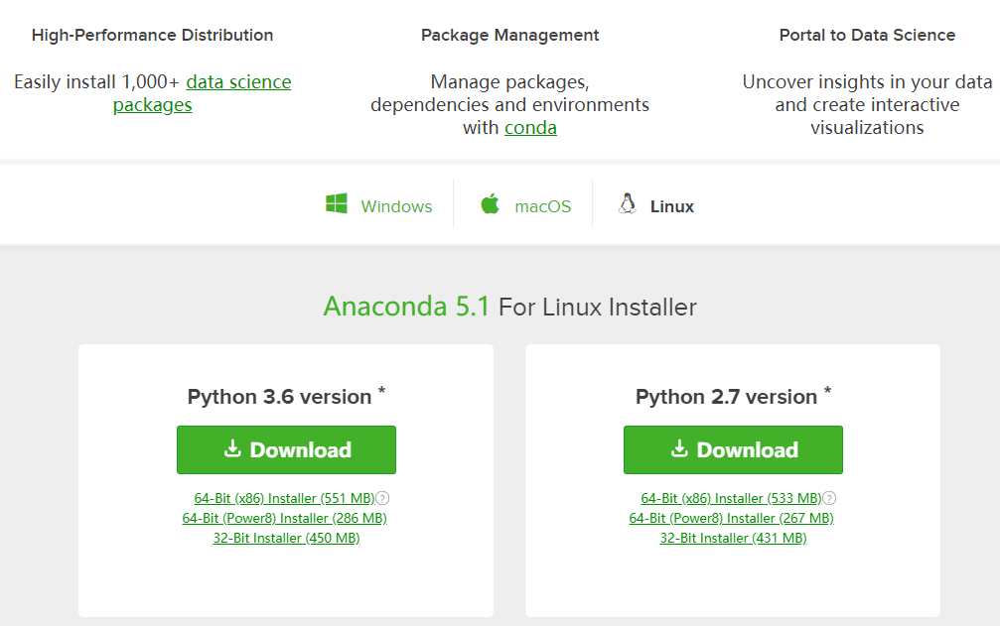
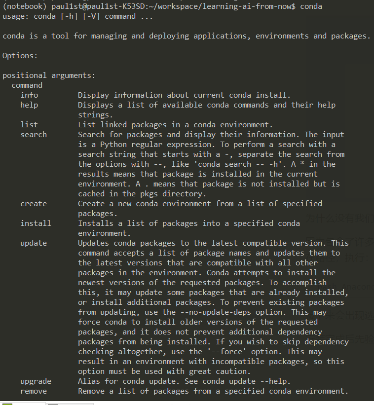

# 环境说明

磨刀不误砍柴工，对于没有接触过机器学习方面的初学者来说，有必要解释一下我们今后都要接触的环境，而这也是我的学习路径。

# 环境准备

首先要说明，三大操作系统Windows, Linux, OSX中，Windows虽然我每天都在用，但我认为这不是一个对开发者特别友好的平台，对于服务器平台以及开发平台来说Linux是比较好的选择，至于没有考虑OSX的原因是我没用过（因为穷）。

## 版本说明

### Linux

Linux有众多发行版，如果你搞得定的话选择哪个发行版问题都不大，不过对于机器学习的许多框架来说，Ubuntu是它们的默认开发环境，考虑到GCC版本等依赖的差异，想要省心的话，那就选择 **Ubuntu 16.04 LTS**。

下载地址：http://www.ubuntu.org.cn/download/desktop

### Python

Python现在有两个大版本，Python 2.7与Python3，比较令人头疼的在于这两个版本有比较大的差异，并不能完全兼容，考虑到Python 3是在Python 2的基础上吸取了一些经验做出的重构，因此在整篇教程中我使用的都是**Python 3.5**这个版本。

# 安装Anaconda

Ubuntu的安装在此不再赘述，网上有许多教程，主要讲一下Python安装的注意事项。

在主流的Linux发行版本中Python都是默认安装的，Ubuntu也不例外，而且16.04版本默认安装了Python2.7和Python3两个版本，这意味着安装完Ubuntu之后我们不必要再单独安装Python就可以使用了。

但是（这个世界上总有但是），Ubuntu自带的Python会涉及到一些系统的组件，其实我不是很建议用它自带的Python作为我们的开发选择，而且我们还有更好的选择： **Anaconda**。

Anaconda是Python的一个发行版，简单点理解就是：它自带了许多科学计算所需要的包及依赖项。可以[点击此处](https://www.anaconda.com/download/)进行下载，考虑到我们开发所需要的版本，可以选择Python 3.6的版本进行下载。



为什么没有我们开发所需要的Python 3.5版本呢？接下来我们会解释这个问题。

因为包含了许多科学计算所需要的包，因此整个安装文件比较大，有551MB(64bit版本)。下载完成后，在文件所在路径，执行：

```bash
bash Anaconda3-5.0.1-Linux-x86_64.sh
```

接下来会出现选择安装路径的窗口，如果没有特别的需求，可以使用默认的配置，一路回车，等待安装完毕。

安装完成后先运行`conda`命令验证一下是否安装成功，如果可以看到以下输出说明一切正常。



不过也有可能会出现无法执行命令的情况：

```bash
conda: command not found
```

如果出现这种情况，则需要把`conda`的执行目录写入环境变量。

```bash
$ vim ~/.bashrc # 修改这个文件只对当前用户有效
```

接着在最后一行添加以下语句：

```bash
export PATH=~/anaconda3/bin:$PATH
```

注销并重新登录当前用户，再运行一下`conda`命令。

## 使用虚拟环境

下面是我最喜欢Python的一点了：虚拟环境。

对于开发来说这点非常友好，在实际的开发中我们可能有不同的项目，需要安装不同的依赖包，而更加可能的情况是依赖包之间的版本也不相同，为了避免环境之间相互污染，我们可以使用虚拟环境来对其进行隔离。

### 新建虚拟环境

```bash
conda create -n py3.5 python=3.5 anaconda
```

使用这个命令代表创建一个名为`py3.5`的虚拟环境，使用`python 3.5`作为基础版本，同时安装anaconda的包。

`-n`代表后加这个虚拟环境的名字， 最后的`anaconda`代表这个虚拟环境需要安装anaconda带的所有科学计算包。如果想创建一个纯净的、没有第三方包的环境，可以不加`anaconda`，不过anaconda所带的科学计算包都很有用，我建议还是加上这个参数。

### 启用虚拟环境

```bash
source activate py3.5
```

输入以上命令，说明启用名为`py3.5`的虚拟环境。可以看到启用后终端前显示了当前环境的名字。


### 退出当前虚拟环境

```bash
source deactivate
```

### 列出创建的所有虚拟环境

```bash
conda env list
```

# 使用Jupyter

Jupyter是一个交互式笔记本，本项目所有的项目jupyter都运行在Jupyter上，我认为其最大的特点在于“边说边做”，所有的代码在这个笔记本里就可以自己跑一跑。

## 运行Jupyter

如果按照上面的顺序阅读下来会惊喜的发现，anaconda默认已经包含了jupyter的包，因此我们不需要再安装这个包了，可以直接运行：

```bash
jupyter notebook
```

不过默认只能在本地的浏览器打开我们的项目，如果我们想远程访问，多人共享的话应该怎么做呢？